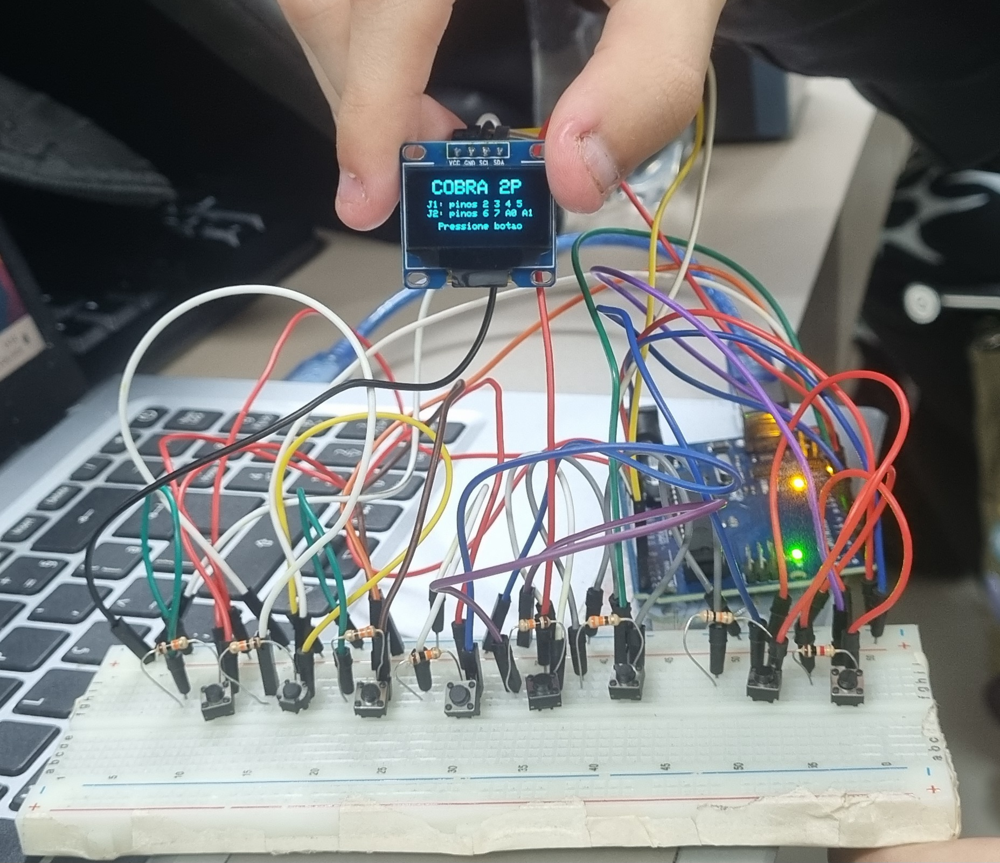

# Trabalho Avaliativo – G2
## Disciplina: Pensamento Computacional

|Integrante:                   |  Responsabilidade no trabalho:                                    |
|------------------------------|-------------------------------------------------------------------|
|Luis Eduardo do Moraes Ferrão |  Escrita, organização da ideia, testes, apresentação              |
|Letícia Fernanda Martinazzo   |  Criação da lógica, construção da simulação, testes, apresentação |

### Primeira etapa: Criação da ideia
**1 - Qual será a ideia principal do trabalho?**  
Criar um console portátil do clássico jogo da cobrinha (Snake) utilizando Arduino e um display OLED, reproduzindo a experiência dos antigos celulares e videogames portáteis, modificando-o para poder ser jogado em dupla.
 
**2 - Como essa ideia surgiu?**  
Surgiu de um projeto feito no instructables que faz possível jogar o jogo da cobrinha em arduino, então tivemos a ideia de aprimorar e fazer possível jogar em dupla o mesmo jogo.

**3 - Por que a dupla escolheu essa proposta?**  
Porque une programação, eletrônica, prática e criatividade em um projeto concreto e divertido, além de ser viável para o nosso nível.

**4 - Qual situação, problema ou necessidade será trabalhada?**  
A necessidade de aplicar nossos aprendizados de lógica de programação e controle do arduino em um projeto real, tangível e funcional, saindo do ambiente puramente teórico da sala de aula.
 
**5 - O que a dupla pretende criar ao final?**  
Um mini-console portátil físico, com Arduino Nano, display OLED, botões direcionais e alimentação por bateria, capaz de rodar o jogo da cobrinha de forma completa (movimentação, pontuação e detecção de colisão). 

### Segunda etapa: Definição do problema ou necessidade
**1 - O que precisa ser resolvido, melhorado ou representado?**  
A necessidade de transformar conceitos abstratos de programação(o jogo da cobrinha) em algo concreto e funcional. 

**2 - Quem poderia utilizar ou se beneficiar desta solução?**  
Estudantes de cursos de tecnologia(como os da AMF), entusiastas do movimento maker e qualquer pessoa interessada em aprender criação de projetos em arduino.
 
**3 - Por que essa solução faria sentido?**  
Porque a gente aprende muito mais ao construir algo que funciona de verdade. O jogo exige que nós dominemos a leitura de botões, controle de display, lógica de movimentação e todo o resto aprendido em aula. 

**4 - O que aconteceria se essa solução fosse aplicada na prática?**  
Teríamos em mãos um projeto físico funcional que demonstra a programação em C++ para Arduino, manipulação de entradas e controle de display — um objeto que pode ser jogado, apresentado e evoluído com novas funcionalidades. 

### Terceira etapa: Planejamento da solução
**1 - O que a solução deverá fazer?**  
Executar o jogo da cobrinha com 2 cobras: mover as cobrinhas pela tela, detectar se elas comeram o alimento, crescer a cada item consumido, registrar a pontuação e encerrar o jogo ao colidir com a parede, com a outra ou com o próprio corpo. 

**2 - Quais informações serão necessárias para ela funcionar?**  
Posição atual de cada segmento da cobra, direção de movimento vigente, posição do alimento na tela, pontuação acumulada e estado atual do jogo (em andamento ou encerrado). 

**3 -Quais ações deverão acontecer?**  
Leitura contínua dos quatro botões direcionais, atualização da posição da cobra a cada ciclo, verificação de colisão com bordas e com o próprio corpo, verificação se a cabeça chegou à posição do alimento, geração de nova posição de alimento, atualização do display e exibição da pontuação em tempo real. 

**4 - Quais decisões a solução precisará tomar?**  
Se a direção pressionada é válida (não é possível inverter o sentido diretamente), se houve colisão e o jogo deve encerrar, se o alimento foi consumido e a cobra deve crescer, e se a velocidade deve aumentar conforme a pontuação sobe. 

**5 - Qual será o resultado esperado?**  
Um jogo completamente funcional no arduino físico, com resposta rápida aos botões, display atualizado em tempo real, pontuação visível durante a partida e exibição de tela de fim de jogo ao ocorrer uma colisão. 

### Quarta etapa: decomposição
**Partes da solução:**
1. Descrição da ideia: Jogo da cobrinha de dois jogadores. Cada um controla sua cobrinha para comer o máximo de comida possível e marcar pontos.
2. Listar materiais para montar o hardware: 8 botões, protoboard, arduino UNO, display OLED, jumpers, resistores.
3. Montar uma simulação do circuito no Wokwi.
4. Fazer o código e resolver problemas nele.
5. Montar o circuito físico.
6. Teste final.

### Quinta etapa: reconhecimento de padrões
**1 - Existem ações repetidas?**  
Sim, várias. As principais:
- Toda a lógica do Jogador 1 se repete para o Jogador 2: snake1/snake2, dir1/dir2, ndir1/ndir2, score1/score2. É a mesma coisa "espelhada".
- A verificação de colisão (parede, próprio corpo, corpo do adversário) é feita igual para as duas cobras.
- A leitura dos 8 botões segue sempre a mesma estrutura: testar se está em LOW e bloquear a inversão de 180°.
- O movimento de cada cobra é idêntico: deslocar o array uma posição e colocar a nova cabeça na posição 0.
- O desenho de cada cobra percorre os segmentos da mesma maneira.

**2 - Existem etapas que seguem uma sequência?**  
Sim. O loop() sempre executa na mesma ordem: ler botões → verificar se passou o tempo do tick → mover cobras → desenhar. Dentro de moveSnakes() também há sequência fixa: aplicar o buffer de direção → calcular as próximas cabeças → checar colisões → mover as vivas → decidir fim de jogo. E o fluxo geral do programa: setup → tela inicial → initGame → loop → gameOver → reinício. 

**3 - Existem situações semelhantes que podem usar a mesma lógica?**  
Sim. Praticamente tudo que vale para a Cobra 1 vale para a Cobra 2 — poderiam usar uma única função que recebe a cobra como parâmetro. A checagem de "esta posição bate com algum segmento ocupado?" aparece tanto na colisão quanto no spawnFood() (que evita gerar comida em cima da cobra): é a mesma lógica em contextos diferentes. 

**4 - Alguma parte da solução pode ser reaproveitada?**  
Sim. Dá para criar funções genéricas e reutilizá-las:
- moverCobra(cobra, direcao) em vez de repetir o código duas vezes.
- verificarColisao(ponto, cobra) usada para parede/corpo e também no spawn da comida.
- desenharCobra(cobra) para renderizar qualquer uma das duas.

### Sexta etapa: abstração
**1 - O que é indispensável para a solução funcionar?**
- O campo (grade) e as cobras representadas como lista de segmentos.
- O movimento por tempo (tick) e a leitura da direção dos botões.
- A comida e o crescimento da cobra ao comê-la.
- A detecção de colisão (parede e corpo) e a condição de fim de jogo.
- O placar e a tela final com o resultado.

**2 - O que pode ficar de fora nesta primeira versão?** 
- A aceleração progressiva (accelerate()).
- O bônus de +3 pontos.
- A diferenciação visual elaborada (X branco na cabeça da Cobra 2, segmentos vazados).
- O buffer anti-inversão (ndir) — poderia começar lendo a direção direto.
- A colisão cabeça-a-cabeça e o empate.
- Telas de boas-vindas e de game over mais trabalhadas.

**3 - Quais elementos precisam aparecer na simulação?**  
A borda do campo, as duas cobras se movendo, a comida, o crescimento ao comer, as colisões e o placar dos dois jogadores.

**4 - Quais detalhes podem ser melhorados apenas depois?**  
A estética (estilo das cabeças e segmentos), a velocidade que aumenta com a pontuação, o sistema de bônus, as telas de abertura/fim, e refinamentos como o buffer de direção e o tratamento de empate. 

### Sétima etapa: algoritmo
**Algoritmo da solução:**

**1. Inclusões e configuração de hardware (linhas 1–54)**  
O código começa incluindo as duas bibliotecas necessárias para o display Nokia 5110 (Adafruit_GFX para gráficos e Adafruit_PCD8544 para o display em si). Em seguida define os pinos físicos: o display usa os pinos 8 a 13, o Jogador 1 usa pinos digitais 2 a 5, e o Jogador 2 usa pinos 6, 7, A0 e A1.  
As constantes do jogo também são definidas aqui: cada célula ocupa 4×4 pixels, o que resulta em um campo de 21 colunas × 10 linhas, com 8 pixels reservados na parte inferior para o placar. Cada cobra pode ter no máximo 40 segmentos.

**2. Variáveis globais (linhas 36–54)**
Declara as estruturas que guardam o estado do jogo durante toda a execução:  
- snake1[] e snake2[] — arrays de pontos (x, y) que representam cada segmento das cobras, da cabeça até a cauda  
- dir1x/dir1y — direção atual do movimento (aplicada no próximo tick)
- ndir1x/ndir1y — direção bufferizada lida dos botões (evita que dois botões pressionados no mesmo tick causem inversão)
- food — posição da comida
- score1/score2, alive1/alive2, gameOver — estado da partida
- lastMove e gameSpeed — controlam o ritmo do jogo por tempo (não por delay bloqueante)

**3. setup() — Inicialização (linhas 66–99)**
Executado uma única vez ao ligar o Arduino. Faz três coisas:  
a) Configura todos os 8 pinos de botões como INPUT_PULLUP — assim ficam em nível HIGH por padrão e vão a LOW quando pressionados, sem precisar de resistor externo.  
b) Inicializa o display, define o contraste e exibe a tela de boas-vindas com o título e os controles de cada jogador.  
c) Entra num laço while que trava o programa até qualquer botão ser pressionado, depois chama initGame() para começar a partida.  
**4. loop() — Ciclo principal (linhas 103–127)**
Executado continuamente. A lógica segue esta ordem a cada iteração:  
a) Chama readButtons() para capturar entradas o mais rápido possível (independente do tick do jogo).  
b) Verifica se já passou o tempo de um tick (gameSpeed ms). Se sim, avança o jogo: chama moveSnakes() e depois drawGame().  
c) Se gameOver for verdadeiro, exibe a tela final, aguarda 3 segundos, espera um botão e reinicia com initGame().  
Esse padrão — verificar tempo com millis() em vez de usar delay() — é crucial para que os botões sejam lidos com fluidez mesmo enquanto o jogo "espera" o próximo tick.

**5. initGame() — Resetar partida (linhas 130–157)**  
Zera pontuações, reativa ambas as cobras e reseta a velocidade para 200 ms. Posiciona as cobras nos lados opostos do campo, ambas na linha do meio:  
Cobra 1 começa na coluna 2 movendo para a direita  
Cobra 2 começa na coluna 16 movendo para a esquerda  
Por fim chama spawnFood() para gerar a primeira comida e drawGame() para exibir o estado inicial.

**6. spawnFood() — Gerar comida (linhas 160–172)**
Sorteia uma posição aleatória dentro do campo e verifica se ela não coincide com nenhum segmento das duas cobras. Repete o sorteio em loop até encontrar uma posição livre. Isso garante que a comida nunca apareça "dentro" de uma cobra.

**7. readButtons() — Capturar botões (linhas 175–187)**
Lê cada um dos 8 botões. Quando um botão está pressionado (nível LOW), atualiza a direção bufferizada (ndir) — mas somente se o movimento não for uma inversão de 180°. Por exemplo, se a cobra está indo para a direita (dir1x == 1), pressionar Esquerda é ignorado.  
O buffer (ndir) é separado da direção atual (dir) justamente para que uma mudança de direção feita entre dois ticks não cause comportamento inesperado — ela só é aplicada no início do próximo tick em moveSnakes().

**8. moveSnakes() — Lógica principal do jogo (linhas 190–252)**
Esta é a função mais importante. A cada tick executa:  
a) Aplica o buffer de direção — copia ndir para dir de ambos os jogadores.  
b) Calcula as próximas cabeças — soma a direção à posição atual da cabeça, obtendo onde cada cobra tentará se mover.  
c) Verifica colisões de J1:  
- Parede (coordenada fora dos limites)  
- Próprio corpo (todos os segmentos exceto o último, que ainda vai se mover)  
- Corpo inteiro de J2  
Se colidiu: alive1 = false e J2 recebe +3 pontos de bônus.  
d) Verifica colisões de J2 — mesma lógica simétrica.  
e) Colisão cabeça-a-cabeça — se as duas cabeças calculadas caem na mesma célula, ambas morrem simultaneamente (empate).  
f) Move as cobras vivas:  
- Verifica se a cabeça chegou à posição da comida
- Desloca todo o array uma posição para frente (a cauda "some")
- Coloca a nova cabeça na posição 0
- Se comeu: aumenta o comprimento, incrementa o placar, gera nova comida e chama accelerate()  
g) Declara fim de jogo se qualquer cobra não estiver mais viva.

**9. accelerate() — Aumentar velocidade (linhas 254–258)**
A cada 5 pontos totais somados pelos dois jogadores, reduz gameSpeed em 10 ms (até o mínimo de 80 ms). Isso faz o jogo ficar progressivamente mais rápido ao longo da partida.  

**10. drawGame() — Renderizar o display (linhas 261–317)**
A cada tick limpa o buffer do display e redesenha tudo do zero:  
a) Borda — um retângulo vazio ao redor do campo.  
b) Comida — dois traços que formam um "X" pequeno na célula da comida.  
c) Cobra 1 — a cabeça é um quadrado totalmente preenchido; os demais segmentos são quadrados com apenas a borda desenhada (vazados), para diferenciar visualmente.  
d) Cobra 2 — a cabeça também é preenchida, mas com um X branco sobreposto para distingui-la da cobra 1; os segmentos do corpo são pequenos quadrados preenchidos.  
e) Placar — uma linha horizontal separa o campo do rodapé, onde J1: X aparece à esquerda e J2: X à direita.  
Por fim, display.display() envia o buffer para o hardware de uma vez.  

**11. drawGameOver() — Tela final (linhas 320–347)**
Limpa o display e exibe três informações:  
- "FIM DE JOGO" centralizado no topo
- Pontuação final dos dois jogadores
- O resultado: "EMPATE!" se ambos morreram juntos, ou o nome do vencedor caso contrário
- Instrução para pressionar um botão e reiniciar

### Oitava etapa: simulação e protótipo
**O que será simulado:**  
**O que a dupla conseguiu iniciar hoje:**  

### Nona etapa: testes e melhorias
1. A simulação funcionou como esperado? Funcionou, depois de várias correções.
2. O que deu certo? O game funciona bem.
3. O que precisa ser corrigido? Alguns possíveis lags/travamentos
4. O que pode ser melhorado? A princípio, nada.
5. A ideia inicial precisou ser modificada? Nossa ideia lá no início era fazer apenas singleplayer, mas decidimos ser um pouco diferentes e fazer multiplayer.

### Conclusão final da dupla:

1. O que a dupla aprendeu durante o desenvolvimento? Como mexer num novo simulador de arduino online (Wokwi) e aprendemos a utilizar telas no arduino.
2. Como o pensamento computacional ajudou na organização da ideia? Montamos o passo a passo da ideia, o que deixou mais fácil a divisão de tarefas entre os componentes do grupo e facilitou a construção da lógica por trás do código do arduino. 
3. A solução criada funcionou como esperado? Funcionou bem.
4. O que poderia ser melhorado em uma próxima versão? Melhorar o design, se possível, melhorar a organização do fios.

### Fotos do circuito digital/físico:
<p align="center">
  
</p>

<p align="center">
  
</p>

### Código:

```bash
// =====================================================
//  JOGO DA COBRA - 2 JOGADORES
//  Hardware: Arduino Uno/Nano + OLED SSD1306 128x64 (I2C) + 8 botões
//  Bibliotecas necessárias: Adafruit SSD1306 + Adafruit GFX
// =====================================================

#include <Wire.h>
#include <Adafruit_GFX.h>
#include <Adafruit_SSD1306.h>

// ---------- Configuração do OLED ----------
#define SCREEN_WIDTH  128
#define SCREEN_HEIGHT  64
#define OLED_RESET     -1   // sem pino de reset (compartilha com Arduino)
// Endereço I2C mais comum: 0x3C. Se não funcionar, tente 0x3D
Adafruit_SSD1306 display(SCREEN_WIDTH, SCREEN_HEIGHT, &Wire, OLED_RESET);

// ---------- Pinos dos botões ----------
#define P1_UP    2
#define P1_DOWN  3
#define P1_LEFT  4
#define P1_RIGHT 5

#define P2_UP    6
#define P2_DOWN  7
#define P2_LEFT  A0
#define P2_RIGHT A1

// ---------- Configurações do campo ----------
// OLED 128x64: usamos 128x54 para jogo + 10px rodapé de placar
#define CELL      4          // pixels por célula
#define COLS     (128/CELL)  // 32 colunas
#define ROWS     (54/CELL)   // 13 linhas
#define MAX_LEN   60         // comprimento máximo de cada cobra

#define FIELD_H  (ROWS * CELL)   // 52px — altura do campo
#define SCORE_Y  (FIELD_H + 2)   // 54px — Y do placar

// ---------- Estrutura de posição ----------
struct Point { int8_t x, y; };

// ---------- Cobras ----------
Point snake1[MAX_LEN], snake2[MAX_LEN];
int    len1, len2;
int8_t dir1x, dir1y, ndir1x, ndir1y;
int8_t dir2x, dir2y, ndir2x, ndir2y;

// ---------- Comida ----------
Point food;

// ---------- Estado ----------
int  score1, score2;
bool alive1, alive2, gameOver;
unsigned long lastMove;
int  gameSpeed = 200;

// ---------- Protótipos ----------
void initGame();
void spawnFood();
void readButtons();
void moveSnakes();
void accelerate();
void drawGame();
void drawGameOver();
void waitAnyButton();

// =====================================================
void setup() {
  pinMode(P1_UP,    INPUT);
  pinMode(P1_DOWN,  INPUT);
  pinMode(P1_LEFT,  INPUT);
  pinMode(P1_RIGHT, INPUT);
  pinMode(P2_UP,    INPUT);
  pinMode(P2_DOWN,  INPUT);
  pinMode(P2_LEFT,  INPUT);
  pinMode(P2_RIGHT, INPUT);

  if (!display.begin(SSD1306_SWITCHCAPVCC, 0x3C)) {
    // Se falhar, trava piscando o LED interno
    pinMode(LED_BUILTIN, OUTPUT);
    while (true) { digitalWrite(LED_BUILTIN, !digitalRead(LED_BUILTIN)); delay(300); }
  }

  display.clearDisplay();
  display.setTextColor(WHITE);  // OLED: fundo preto, texto/pixels brancos

  // Tela de boas-vindas
  display.setTextSize(2);
  display.setCursor(16, 4);  display.print("COBRA 2P");
  display.setTextSize(1);
  display.setCursor(10, 26); display.print("J1: pinos 2 3 4 5");
  display.setCursor(10, 36); display.print("J2: pinos 6 7 A0 A1");
  display.setCursor(22, 50); display.print("Pressione botao");
  display.display();

  waitAnyButton();
  delay(200);
  initGame();
}

// =====================================================
void loop() {
  readButtons();

  if (!gameOver && millis() - lastMove >= (unsigned long)gameSpeed) {
    lastMove = millis();
    moveSnakes();
    drawGame();
  }

  if (gameOver) {
    drawGameOver();
    delay(3000);
    waitAnyButton();
    delay(200);
    initGame();
  }
}

// =====================================================
void initGame() {
  score1 = 0; score2 = 0;
  alive1 = true; alive2 = true;
  gameOver = false;
  gameSpeed = 200;

  // Cobra 1: esquerda, linha central superior, vai para direita
  len1 = 3;
  for (int i = 0; i < len1; i++) { snake1[i].x = 4 - i; snake1[i].y = ROWS / 3; }
  dir1x = 1; dir1y = 0; ndir1x = 1; ndir1y = 0;

  // Cobra 2: direita, linha central inferior, vai para esquerda
  len2 = 3;
  for (int i = 0; i < len2; i++) { snake2[i].x = COLS - 5 + i; snake2[i].y = (ROWS * 2) / 3; }
  dir2x = -1; dir2y = 0; ndir2x = -1; ndir2y = 0;

  spawnFood();
  lastMove = millis();
  drawGame();
}

// =====================================================
void spawnFood() {
  bool ok = false;
  while (!ok) {
    food.x = random(0, COLS);
    food.y = random(0, ROWS);
    ok = true;
    for (int i = 0; i < len1 && ok; i++)
      if (snake1[i].x == food.x && snake1[i].y == food.y) ok = false;
    for (int i = 0; i < len2 && ok; i++)
      if (snake2[i].x == food.x && snake2[i].y == food.y) ok = false;
  }
}

// =====================================================
void readButtons() {
  if (digitalRead(P1_UP)    == HIGH && dir1y !=  1) { ndir1x =  0; ndir1y = -1; }
  if (digitalRead(P1_DOWN)  == HIGH && dir1y != -1) { ndir1x =  0; ndir1y =  1; }
  if (digitalRead(P1_LEFT)  == HIGH && dir1x !=  1) { ndir1x = -1; ndir1y =  0; }
  if (digitalRead(P1_RIGHT) == HIGH && dir1x != -1) { ndir1x =  1; ndir1y =  0; }

  if (digitalRead(P2_UP)    == HIGH && dir2y !=  1) { ndir2x =  0; ndir2y = -1; }
  if (digitalRead(P2_DOWN)  == HIGH && dir2y != -1) { ndir2x =  0; ndir2y =  1; }
  if (digitalRead(P2_LEFT)  == HIGH && dir2x !=  1) { ndir2x = -1; ndir2y =  0; }
  if (digitalRead(P2_RIGHT) == HIGH && dir2x != -1) { ndir2x =  1; ndir2y =  0; }
}

// =====================================================
void moveSnakes() {
  dir1x = ndir1x; dir1y = ndir1y;
  dir2x = ndir2x; dir2y = ndir2y;

  Point head1 = { (int8_t)(snake1[0].x + dir1x), (int8_t)(snake1[0].y + dir1y) };
  Point head2 = { (int8_t)(snake2[0].x + dir2x), (int8_t)(snake2[0].y + dir2y) };

  // Colisões J1
  if (alive1) {
    bool hit = false;
    if (head1.x < 0 || head1.x >= COLS || head1.y < 0 || head1.y >= ROWS) hit = true;
    for (int i = 0; i < len1 - 1 && !hit; i++)
      if (snake1[i].x == head1.x && snake1[i].y == head1.y) hit = true;
    for (int i = 0; i < len2 && !hit; i++)
      if (snake2[i].x == head1.x && snake2[i].y == head1.y) hit = true;
    if (hit) { alive1 = false; score2 += 3; }
  }

  // Colisões J2
  if (alive2) {
    bool hit = false;
    if (head2.x < 0 || head2.x >= COLS || head2.y < 0 || head2.y >= ROWS) hit = true;
    for (int i = 0; i < len2 - 1 && !hit; i++)
      if (snake2[i].x == head2.x && snake2[i].y == head2.y) hit = true;
    for (int i = 0; i < len1 && !hit; i++)
      if (snake1[i].x == head2.x && snake1[i].y == head2.y) hit = true;
    if (hit) { alive2 = false; score1 += 3; }
  }

  // Colisão cabeça-a-cabeça
  if (alive1 && alive2 && head1.x == head2.x && head1.y == head2.y) {
    alive1 = false; alive2 = false;
  }

  // Mover J1
  if (alive1) {
    bool ate = (head1.x == food.x && head1.y == food.y);
    int newLen = ate ? min(len1 + 1, MAX_LEN) : len1;
    for (int i = newLen - 1; i > 0; i--) snake1[i] = snake1[i-1];
    snake1[0] = head1;
    if (ate) { len1 = newLen; score1++; spawnFood(); accelerate(); }
  }

  // Mover J2
  if (alive2) {
    bool ate = (head2.x == food.x && head2.y == food.y);
    int newLen = ate ? min(len2 + 1, MAX_LEN) : len2;
    for (int i = newLen - 1; i > 0; i--) snake2[i] = snake2[i-1];
    snake2[0] = head2;
    if (ate) { len2 = newLen; score2++; spawnFood(); accelerate(); }
  }

  if (!alive1 || !alive2) gameOver = true;
}

// =====================================================
void accelerate() {
  int total = score1 + score2;
  if (total % 5 == 0 && gameSpeed > 80) gameSpeed -= 10;
}

// =====================================================
void drawGame() {
  display.clearDisplay();

  // Borda do campo
  display.drawRect(0, 0, COLS * CELL, ROWS * CELL, WHITE);

  // Comida — círculo pequeno
  int fx = food.x * CELL + CELL / 2;
  int fy = food.y * CELL + CELL / 2;
  display.fillCircle(fx, fy, 1, WHITE);

  // Cobra 1 — cabeça cheia, corpo vazado (borda)
  for (int i = 0; i < len1; i++) {
    int px = snake1[i].x * CELL;
    int py = snake1[i].y * CELL;
    if (i == 0) {
      display.fillRect(px, py, CELL, CELL, WHITE);
    } else {
      display.drawRect(px + 1, py + 1, CELL - 2, CELL - 2, WHITE);
    }
  }

  // Cobra 2 — cabeça cheia com X, corpo preenchido menor
  for (int i = 0; i < len2; i++) {
    int px = snake2[i].x * CELL;
    int py = snake2[i].y * CELL;
    if (i == 0) {
      display.fillRect(px, py, CELL, CELL, WHITE);
      // X branco invertido para distinguir a cabeça
      display.drawLine(px,        py,        px+CELL-1, py+CELL-1, BLACK);
      display.drawLine(px+CELL-1, py,        px,        py+CELL-1, BLACK);
    } else {
      display.fillRect(px + 1, py + 1, CELL - 2, CELL - 2, WHITE);
    }
  }

  // Linha separadora do placar
  display.drawFastHLine(0, FIELD_H, SCREEN_WIDTH, WHITE);

  // Placar
  display.setTextSize(1);
  display.setTextColor(WHITE);

  // J1 à esquerda
  display.setCursor(2, SCORE_Y);
  display.print("J1:");
  display.print(score1);

  // Velocidade no centro
  display.setCursor(46, SCORE_Y);
  display.print("Spd:");
  display.print(200 - gameSpeed + 80);  // valor crescente p/ o jogador

  // J2 à direita
  display.setCursor(90, SCORE_Y);
  display.print("J2:");
  display.print(score2);

  display.display();
}

// =====================================================
void drawGameOver() {
  display.clearDisplay();
  display.setTextColor(WHITE);

  // Título grande
  display.setTextSize(2);
  display.setCursor(10, 2);
  display.print("FIM DE JOGO");

  // Resultado
  display.setTextSize(1);
  display.setCursor(20, 24);
  if (!alive1 && !alive2) {
    display.print("*** EMPATE! ***");
  } else if (!alive1) {
    display.print(">> J2 VENCEU! <<");
  } else {
    display.print(">> J1 VENCEU! <<");
  }

  // Pontuação
  display.setCursor(14, 38);
  display.print("J1: ");
  display.print(score1);
  display.print(" pts    J2: ");
  display.print(score2);
  display.print(" pts");

  // Instrução
  display.setCursor(16, 54);
  display.print("Pressione um botao");

  display.display();
}

// =====================================================
void waitAnyButton() {
  while (digitalRead(P1_UP)    == LOW &&
         digitalRead(P1_DOWN)  == LOW &&
         digitalRead(P1_LEFT)  == LOW &&
         digitalRead(P1_RIGHT) == LOW &&
         digitalRead(P2_UP)    == LOW &&
         digitalRead(P2_DOWN)  == LOW &&
         digitalRead(P2_LEFT)  == LOW &&
         digitalRead(P2_RIGHT) == LOW) { delay(10); }
}

```
### Link no Wokwi:
https://wokwi.com/projects/467036581798666241


